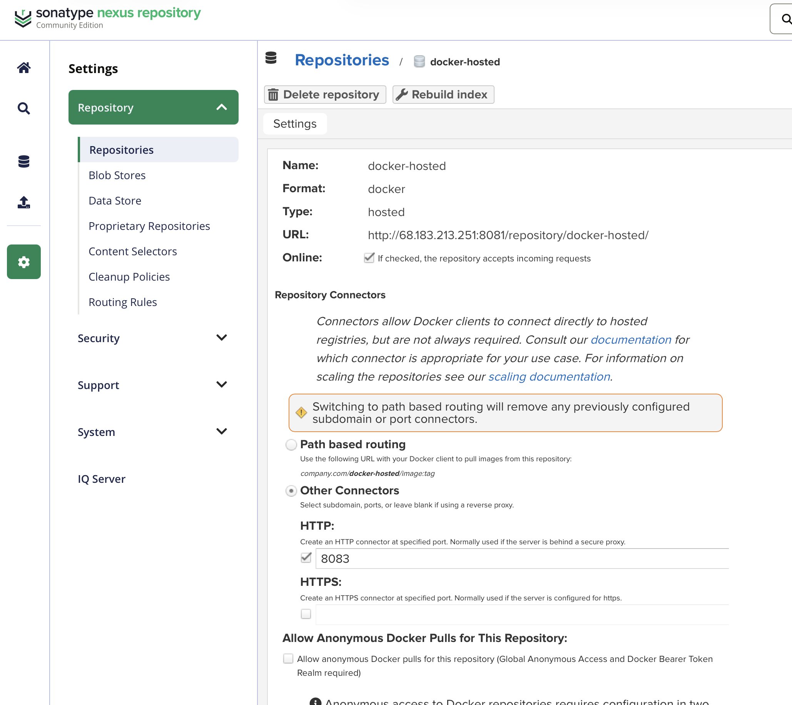
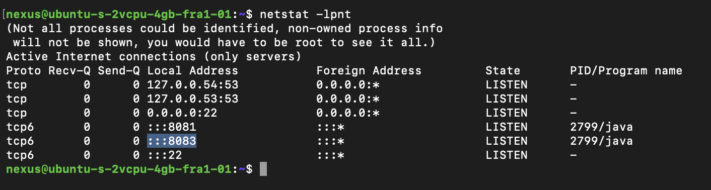
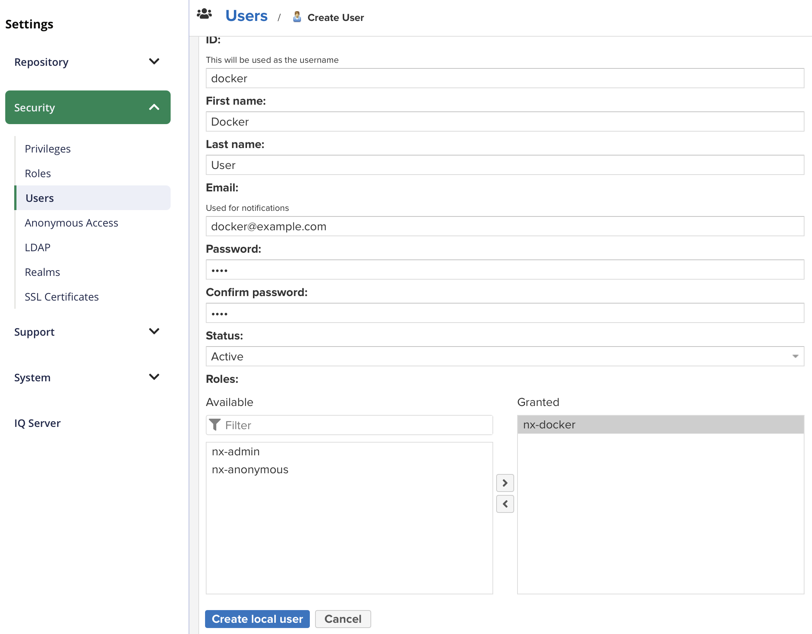
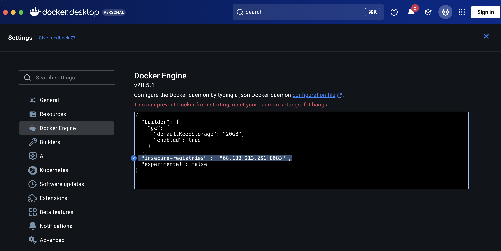
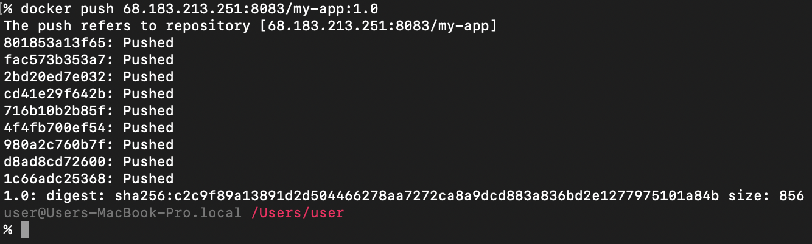
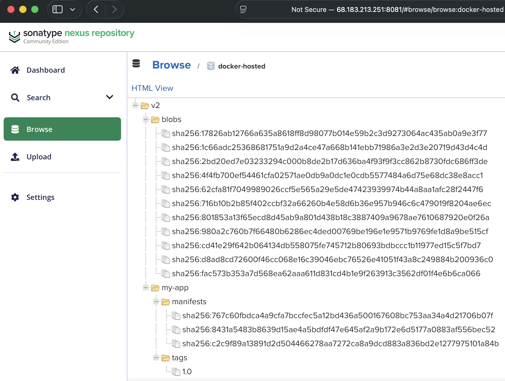

# Module 7 - Containers with Docker

This repository contains a demo project created as part of my **DevOps studies** in the **TechWorld with Nana – DevOps Bootcamp**.

https://www.techworld-with-nana.com/devops-bootcamp

***Demo Project:*** Create Docker repository on Nexus and push to it

***Technologies used:*** Docker, Nexus, DigitalOcean, Linux

***Project Description:*** 

- Create Docker hosted repository on Nexus
- Create Docker repository role on Nexus
- Configure Nexus, DigitalOcean Droplet and Docker to be able to push to Docker repository
- Build and Push Docker image to Docker repository on Nexus

---

## Step 1: Create Docker Repository in Nexus

Navigate to the Nexus repository management page:

```sh
http://<DROPLET_IP>:8081/#admin/repository/repositories
```

Create a new Docker hosted repository with the following settings:

- **Repository Type:** `docker (hosted)`
- **Name:** `docker-hosted`
- **HTTP Port:** `8083`



### Verify Port Configuration

Run the following command on your droplet to verify the port is listening:

```sh
netstat -lpnt
```



### Configure Firewall

Expose port `8083` in the DigitalOcean droplet firewall to allow external Docker client connections.

## Step 2: Create Nexus Role for Docker Access

Navigate to **Security → Roles** in Nexus and create a new role:

- **Role ID:** `nx-docker`
- **Privilege:** `nx-repository-view-docker-docker-hosted-*`

This role grants the necessary permissions to view and access the Docker hosted repository.

## Step 3: Create Nexus User

Navigate to **Security → Users** and create a new user:

- **User ID:** `docker`
- **Password:** `pass`
- **Role:** `nx-docker`

> **Note:** For production environments, use a strong password instead of `pass`.



## Step 4: Configure Docker Bearer Token Realm

Navigate to **Security → Realms** and activate the `Docker Bearer Token Realm` by moving it to the **Active** list. This enables Docker authentication with Nexus.

## Step 5: Configure Docker to Allow Insecure Registry

Since Nexus is running over HTTP (not HTTPS), you need to configure Docker to allow insecure connections.

### On Docker Desktop

Navigate to **Settings → Docker Engine** and add the insecure registry configuration:

```json
{
  "insecure-registries": ["<DROPLET_IP>:8083"]
}
```



Click **Apply & Restart** to save the changes.

### On Linux

Edit the Docker daemon configuration file:

```sh
sudo nano /etc/docker/daemon.json
```

Add the same configuration and restart Docker:

```sh
sudo systemctl restart docker
```

> **Security Note:** Using HTTP registries is not recommended for production. Consider setting up TLS/SSL certificates for secure communication.

## Step 6: Authenticate with Nexus Docker Registry

Log in to the Nexus Docker registry using the credentials created earlier:

```sh
docker login <DROPLET_IP>:8083
```

When prompted, enter:
- **Username:** `docker`
- **Password:** `pass`

You should see a `Login Succeeded` message upon successful authentication.

## Step 7: Build the Application Docker Image

If you haven't already built your application image, build it now:

```sh
docker build -t my-app:1.0 .
```

This command builds the Docker image from the Dockerfile in the current directory and tags it as `my-app:1.0`.

## Step 8: Tag and Push Image to Nexus Repository

### Tag the Image

Tag your local image with the Nexus registry URL:

```sh
docker tag my-app:1.0 <DROPLET_IP>:8083/my-app:1.0
```

### Push the Image

Push the tagged image to the Nexus repository:

```sh
docker push <DROPLET_IP>:8083/my-app:1.0
```



### Verify in Nexus UI

You should now see your image in the Nexus repository browser:



### Verify Using Nexus API

You can also verify the image was pushed successfully using the Nexus REST API:

```sh
curl -u docker:pass -X GET 'http://<DROPLET_IP>:8081/service/rest/v1/components?repository=docker-hosted'
```

This command retrieves all components stored in the `docker-hosted` repository.
